最近装机频繁，抹掉系统之后装来装去就那几个 App，就那点设置。

索性记录下配置新 Mac 时的设置，顺便整理分享一些比较好用的 Mac App。

内容主要分为三大块：[系统设置](https://macos-defaults.com/)、安装应用软件(Homebrew)、数据迁移。

## 系统设置

### 键盘

为了方便连续输入，调整按键重复速度：系统偏好设置 > 键盘

* 按键重复速度：最快

* 重复前延迟：短（或倒数第二格）

### 触控板

[默认触控板需要按到底，且部分手势没开启，按需调整](https://wild-flame.github.io/guides/docs/mac-os-x-setup-guide/preference_and_settings/readme)

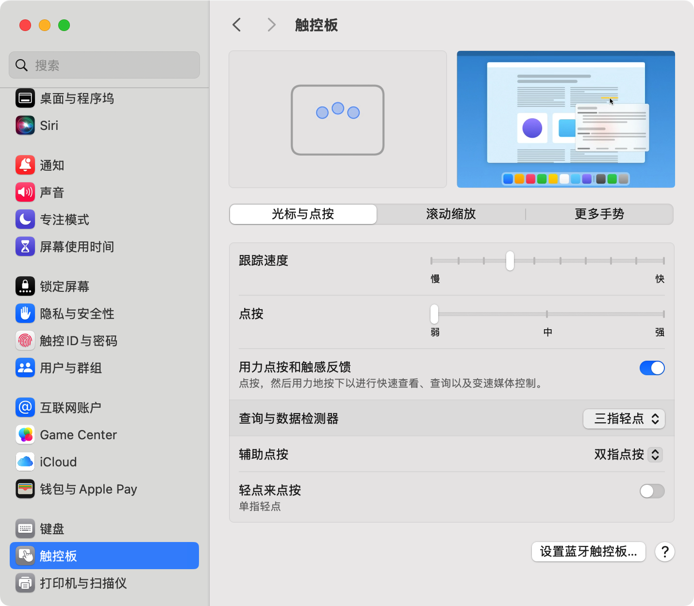

* 修改点按力度，开启轻按触摸：系统设置 > 触控板 > 光标与点按 > 点按「**中**」

* 快速单词查询，开启三指轻点：系统设置 > 触控板 > 光标与点按 > 查询数据检测器「**三指轻点**」

* 实现鼠标右键，开启双指点按：系统设置 > 触控板 > 光标与点按 > 辅助点按「**双指点按**」

* 避免误触发，关闭轻点：系统设置 > 触控板 > 光标与点按 > 辅助点按关闭「**轻点来点按**」

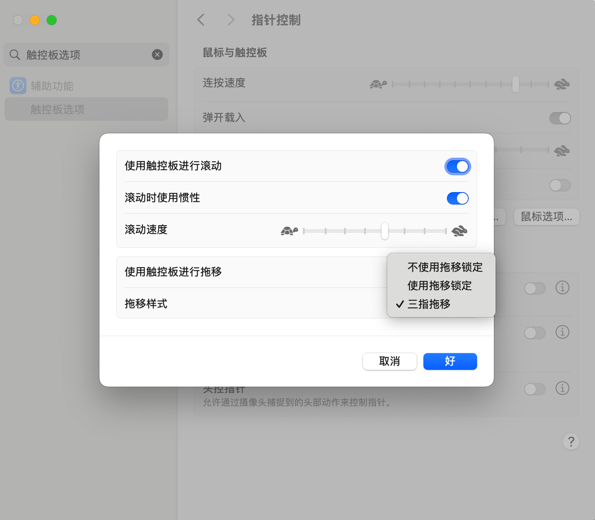

* [三指选中多行文本](https://sspai.com/post/39202)。开启三指拖拽：系统设置 > 辅助功能 > 互动 > 鼠标与触控板 > 触控板选项「三指拖移」

### 台前调度设置

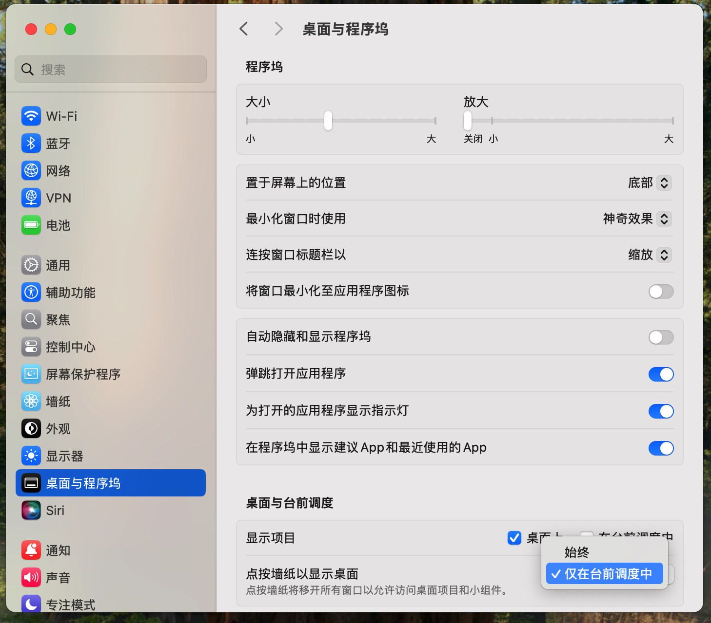非常糟糕的交互特性，容易误触，关闭台前调度中墙纸点按收放：设置 > 桌面与拓展坞 > 点按墙纸以显示桌面「仅在台前调度中」

### Finder 设置

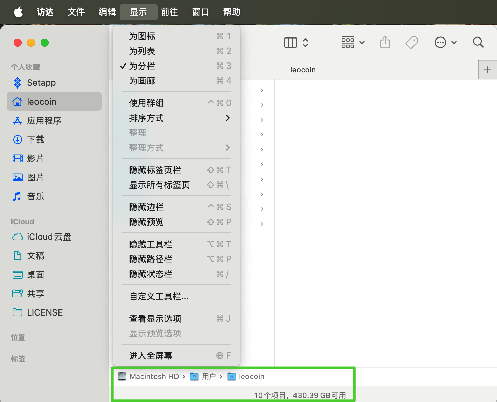打开 Finder，在屏幕右上角选择「偏好设置」（command + .）

* 设置新窗口默认打开位置：Home 目录

* 自定义侧边栏选项

* 显示路径栏和状态栏

### Terminal 设置

Mac 自带的 Terminal 终端很好用，但缺点是比较简陋，文本既没高亮，信息又不完整。

可以通过修改 Shell 配置文件 `~/.zshrc` 来实现 **文件夹高亮显示、完整路径显示。**

配置前后的差异如下：

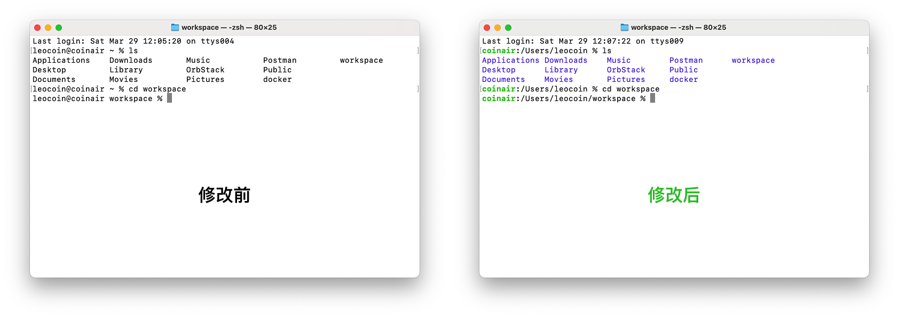

```bash
export LC_ALL=en_US.UTF-8                  # 全局区域设置：美式英语 + UTF-8
export LANG=en_US.UTF-8
export CLICOLOR=1                          # 让 ls 等命令输出颜色
export LSCOLORS='Exfxcxdxbxegedabagacad'   # ls 配色方案
export PS1="%B%F{034}%m%f%b:%~ %F{green}%%%f " # 主机名 + 当前目录 + 彩色提示符

```

### Time Machine

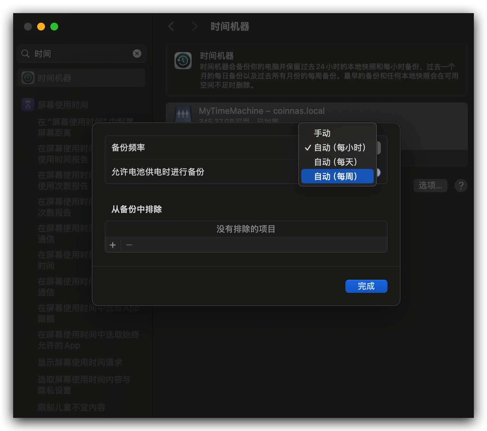有 Mac，有 NAS，那么碎片化整机增量备份，Time Machine 自然少不了。

注：为避免 NAS 硬盘炒豆子噪音，可以降低备份频率到「每周一次」

### 远程连接

为了能随时把这台 Mac 当作一台小服务器用，系统里把远程登录、屏幕共享和文件共享打开即可。

配置位置：系统设置 > 通用 > 共享。

* 电脑名称：改成容易识别的名字，比如 `macmini`。点右侧「编辑」，确认本地主机名，局域网里可以用 `macmini.local` 访问。

* 远程登录：打开后选择允许访问的用户，建议只给自己的管理员账号或单独的维护账号。之后可以通过 `ssh 用户名@macmini.local` 或 `ssh 用户名@IP` 进入命令行。

* 屏幕共享：打开后同样限制可访问用户。需要从 Jump Desktop、Finder 或其他 VNC 客户端连接时，记下系统给出的 `vnc://` 地址；如果要给标准 VNC 客户端用，在信息按钮里设置 VNC 密码。

* 文件共享：打开后在「共享文件夹」里只加需要远程访问的目录，再给账号配置读写权限。需要 SMB 访问时，进入「选项」打开 SMB，并勾选允许登录的账号，连接地址是 `smb://macmini.local` 或 `smb://IP`。

* 防火墙：如果开启了防火墙，在「网络 > 防火墙 > 选项」里允许远程登录、屏幕共享和文件共享。

如果是 MacBook Pro 当 server 用，还要单独处理屏幕和盒盖。比较稳的方式是接电后让屏幕自己熄灭，但机器不进入睡眠：

```bash
sudo pmset -c sleep 0 displaysleep 480 disksleep 0 ttyskeepawake 1 womp 1
pmset -g custom

```

上面只改接电状态，电池状态仍然保留系统默认策略。`sleep 0` 是接电不自动休眠，`displaysleep 10` 是 480 分钟后关闭屏幕，`ttyskeepawake 1` 可以避免 SSH 会话还在时系统进入空闲睡眠，`womp 1` 用来打开有线网络唤醒。

### 禁用 .DS_Store

用 Mac 压缩过文件的朋友应该都见过 zip 包中的 💩：[.DS\_Store](https://zh.wikipedia.org/wiki/.DS_Store)，[\_\_MACOSX](https://www.betterzip.net/faq/mac-osx.html)

.DS\_Store 文件（Desktop Service Store）是一种由苹果公司的 Mac OS X 操作系统所创造的隐藏文件，目的在于存贮目录的自定义属性，主要用于存放元数据，比如记录一些图标大小、查看方式等。

打开命令行，[禁用 .DS\_Store 文件生成](https://www.bilibili.com/video/BV1L4znYWECG/)：

```bash
defaults write com.apple.desktopservices DSDontWriteNetworkStores -bool TRUE

```

## 开发工具

### Surge

配置好科学上网后，后续软件的安装难度呈指数级下降。

如果要把 Mac 配成家里的软路由，核心思路是让 Mac 跑 Surge 网关模式，再让局域网设备把网关和 DNS 指向这台 Mac。这里有两种做法，手动指定网关适合少量设备，Surge DHCP 适合统一下发网络配置，不要混着配。

共同前置：

* Mac 接有线网口，不建议用 Wi-Fi 做网关。给 Mac 固定一个局域网 IP，比如 `192.168.50.2`。

* 在 Surge 里导入可用配置，确认 DNS 有上游服务器，然后打开「增强模式」或「VM 网关」。Surge Mac 6 以后可以优先用 VM 网关，普通场景用增强模式也够。

方案一：手动指定设备网关。

这种方式不动路由器 DHCP，路由器继续负责拨号、Wi-Fi、交换和地址分配。只在需要走 Surge 的设备上手动改网络设置：网关填 Mac 的 IP，DNS 填 `198.18.0.2`。改完后让设备重新连接 Wi-Fi，确认它的网关已经指向 Mac。

如果只想让手机、游戏机、电视这类少数设备走 Surge，优先用这个方案。回滚也简单，把设备上的网关和 DNS 改回自动获取即可。

方案二：Surge DHCP 自动下发网关。

这种方式由 Surge 给局域网设备下发网关和 DNS，适合全家设备都走这台 Mac。先在路由器里关闭原来的 DHCP，只保留 Surge 的 DHCP，然后到 Surge 的「设备」里打开 DHCP 服务器，选择有线网卡。

Surge DHCP 负责下发网络配置，设备是否走 Surge 还要看网关模式里的设备开关。在 Surge 设备列表里右键目标设备，选择「使用 Surge 作为网关」。如果想默认接管所有新设备，再打开默认使用 Surge 作为网关。配好后让手机、电脑重新连接 Wi-Fi，确认它们拿到的网关是 Mac 的 IP。

这个软路由方案需要留一条回滚路径：如果网络断了，先关闭 Surge 的 DHCP，再回路由器里打开 DHCP，就能恢复普通路由器上网。
（TODO：Fallback 到 F50 Pro 做热备）

参考：

* [Surge Mac 网关模式配置指南](https://kb.nssurge.com/surge-knowledge-base/zh/guidelines/gateway)

* [Macmini Surge做网关软路由，mesh组网全家科学上网翻墙](https://dosbat.com/2024/10/08/Macmini+surge+asus%20mesh%E7%BB%84%E7%BD%91/index.html)

* [一次网络建设踩坑记](https://oftime.net/2021/07/27/net/)

* [Surge 把你的Mac 变成最强路由器](https://blog.qust.me/MacSurgeRouter)

### Homebrew

[Homebrew](https://brew.sh/) 是 Mac 下面的包管理工具（类似于 apt、yum），可以安装、卸载 Mac GUI/CLI 应用程序。

* 安装 Command Line Tools

```bash
xcode-select --install

```

* 安装 Homebrew

```bash
/bin/bash -c "$(curl -fsSL https://raw.githubusercontent.com/Homebrew/install/HEAD/install.sh)"

```

### Node.js

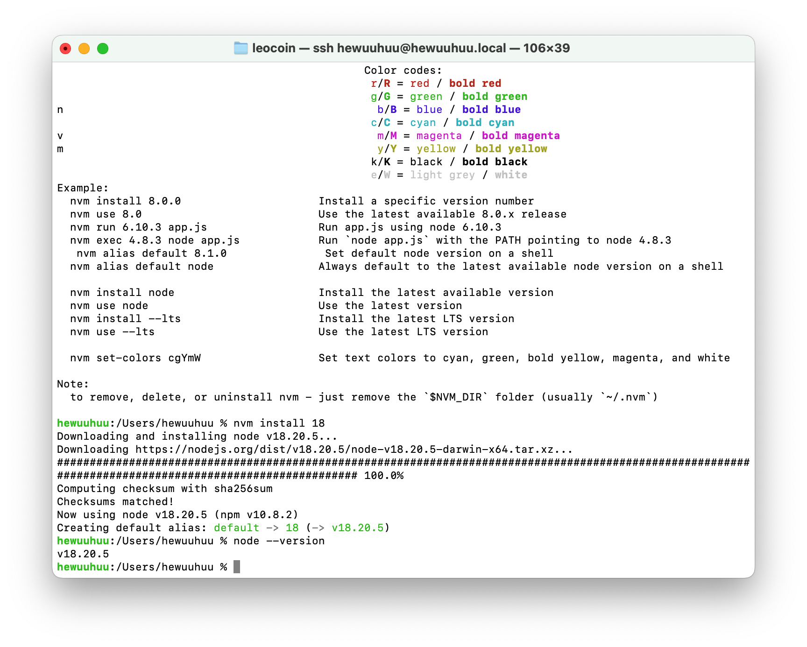

以前这里会先装 [NVM](https://github.com/nvm-sh/nvm)，再用 `npm install -g` 安装一批全局 CLI。现在这条链路可以收掉，Claude Code 和 Codex 不再靠全局 npm 包安装，按各自的安装方式恢复即可。

Node.js 只在项目需要时再装。需要多版本 Node 的项目，继续用 nvm；只跑普通前端项目时，优先跟着项目里的 `.nvmrc`、`packageManager`、`corepack` 走，不把全局工具绑到某个 Node 版本上。

最小安装和使用：

```bash
curl -o- https://raw.githubusercontent.com/nvm-sh/nvm/v0.40.1/install.sh | bash
nvm install --lts
nvm use --lts
node --version

```

### Claude Code

Claude Code，人生导师克老师，必装，没什么好说的，尤其应该先装，装完之后把这个文章丢给他就能给哥们配电脑了。

直接通过 Homebrew 安装即可：`brew install --cask claude claude-code`

```bash
claude --version
```

新机器恢复时重点保留 `~/.claude`，这里面有登录状态、使用记录和历史对话。恢复完后先跑一次 `claude --version`，再在一个测试仓库里启动 Claude Code，确认能正常读取项目和执行命令。

### Codex CLI

Codex 也是必装，接入 sub2api，之前是作为 fallback 备用，现在越来越顺手了，有超越克老师的潜质。

也是直接通过 Homebrew 安装即可：`brew install --cask codex codex-app`

```bash
codex --version
```

新机器恢复时重点备份 `~/.codex`：

* `~/.codex/auth.json`：登录状态，恢复后可以少走一次登录。

* `~/.codex/config.toml`：本机偏好、模型和工具相关配置，如果有自定义就一起带上。

> [事实上官方也推荐这么做](https://github.com/openai/codex/blob/main/docs/authentication.md)

## 应用软件

通过 Homebrew 可以快速安装各种 GUI app：`brew install --cask 软件名标识符`

个人使用 Homebrew 安装的软件如下。

```markup
# 完整安装脚本见：https://gist.github.com/LiaoGuoYin/fe54e5e653ec3e2debbc02828189d651
# 开发工具包
echo "Installing development tools..."
brew install git
brew install vim
brew install curl
brew install wget
brew install tree
brew install jq
brew install gh
brew install scrcpy
brew install syncthing
brew install tmux
brew install uv
brew install xcodegen

# 安装常用应用程序
echo "Installing applications..."
# 下文会详细介绍的 app
brew install --cask surge
brew install --cask 1password
brew install --cask downie
brew install --cask figma
brew install --cask handbrake-app
brew install --cask heynote
brew install --cask orbstack
brew install --cask raycast
brew install --cask spotify
brew install --cask typora
brew install --cask visual-studio-code
brew install --cask adobe-creative-cloud
brew install --cask jump-desktop

# 其他常规软件
brew install --cask 1password-cli
brew install --cask android-platform-tools
brew install --cask wechat
brew install --cask google-chrome
brew install --cask tencent-meeting
brew install --cask appcleaner
brew install --cask imageoptim
brew install --cask charles
brew install --cask microsoft-office
brew install --cask telegram-desktop
brew install --cask proxyman
brew install --cask eudic
brew install --cask iina
brew install --cask ogdesign-eagle
brew install --cask tailscale-app
brew install --cask chatgpt
brew install --cask claude
brew install --cask codex
brew install --cask codex-app
brew install --cask cursor
brew install --cask muxy
brew install --cask termius

```

下面捡几个详细介绍一下。

### OrbStack

几年前用过 Docker for Desktop 不是很好用，用着有种比较臃肿、很重的感觉。

OrbStack 是一个不错的轻量化替代方案。

注：M 系列 Mac 是 Arm 架构，实际测试下来有很多容器程序可能没有非 x86 镜像

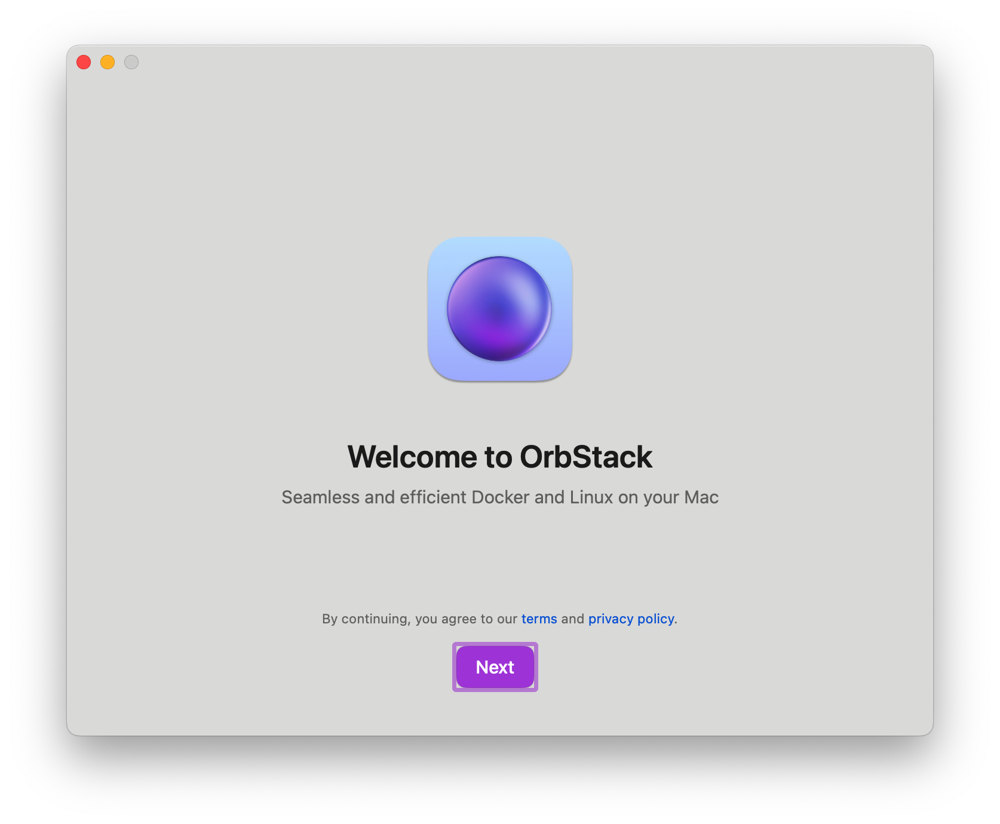

### Git

代码版本管理。安装 Git，配置 commiter 信息。

```bash
git config --global user.name "coin"
git config --global user.email "liaoguoyin#live.com"

```

### VS Code

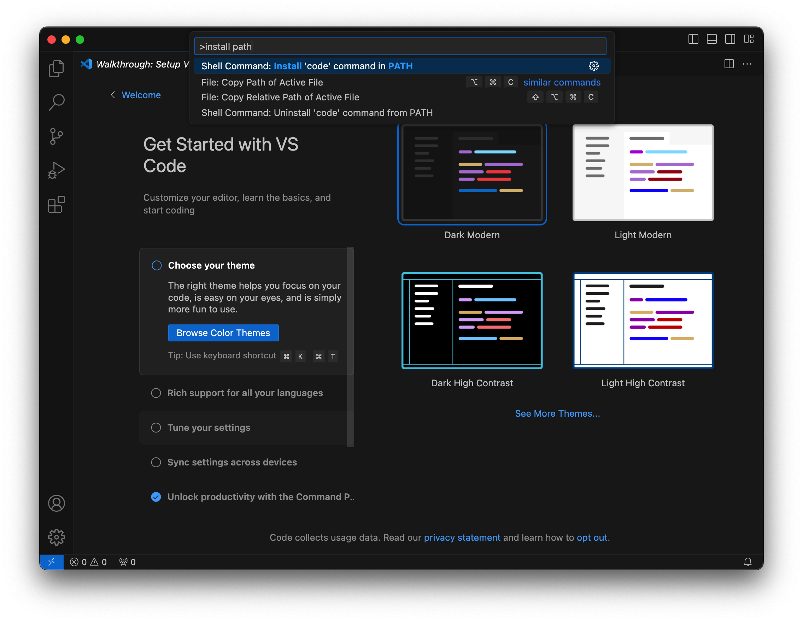

* 安装 code 命令行快速启动。运行 VS Code，打开命令面板（`command + shift + p`）输入 `Shell` 找到「Shell 命令: 在 PATH 中安装 code 命令」

* 导入个人配置：[coin-vscode VS Code Profile](https://vscode.dev/profile/github/76fccdbe9500129e8fd731c7fc0f6413)。打开链接后导入 profile，会带上当前导出的 `settings`、`keybindings`、`snippets` 和 31 个插件清单，包括 Claude Code、Ruff、Prettier、markdownlint、GitLens、Python/Pylance、Remote SSH/Dev Containers、YAML、Live Server、vscode-icons 等。

### Typora


* Markdown 编辑器。所见即所得。

### Raycast

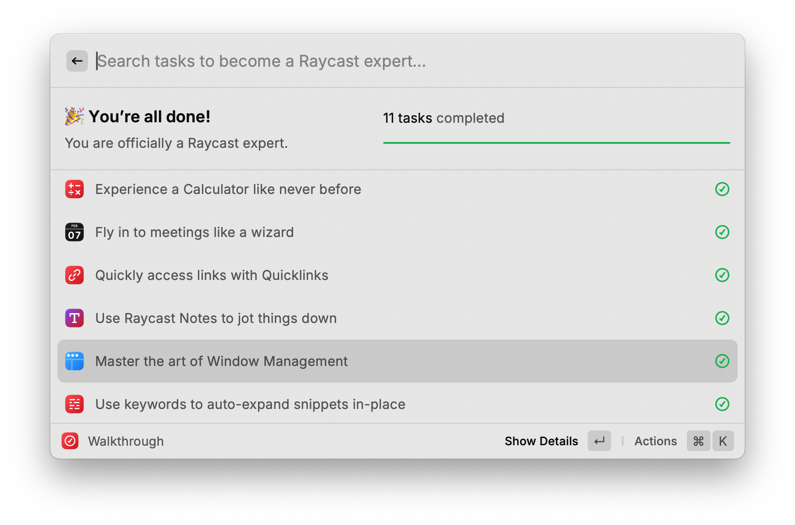

替换 Spotlight 的瑞士军刀，一个软件能平替好几个软件。年度值得订阅的软件。

* 记录剪切板历史并在设备间同步，替换 Paste、PasteNow

* 文字 OCR，替换微信 OCR

* 整段翻译，替换欧陆词典、DeepL

* 窗口管理，替换 Magnet

* OpenAI Chat 能力

* 简单计算器，汇率实时转换

### HeyNote

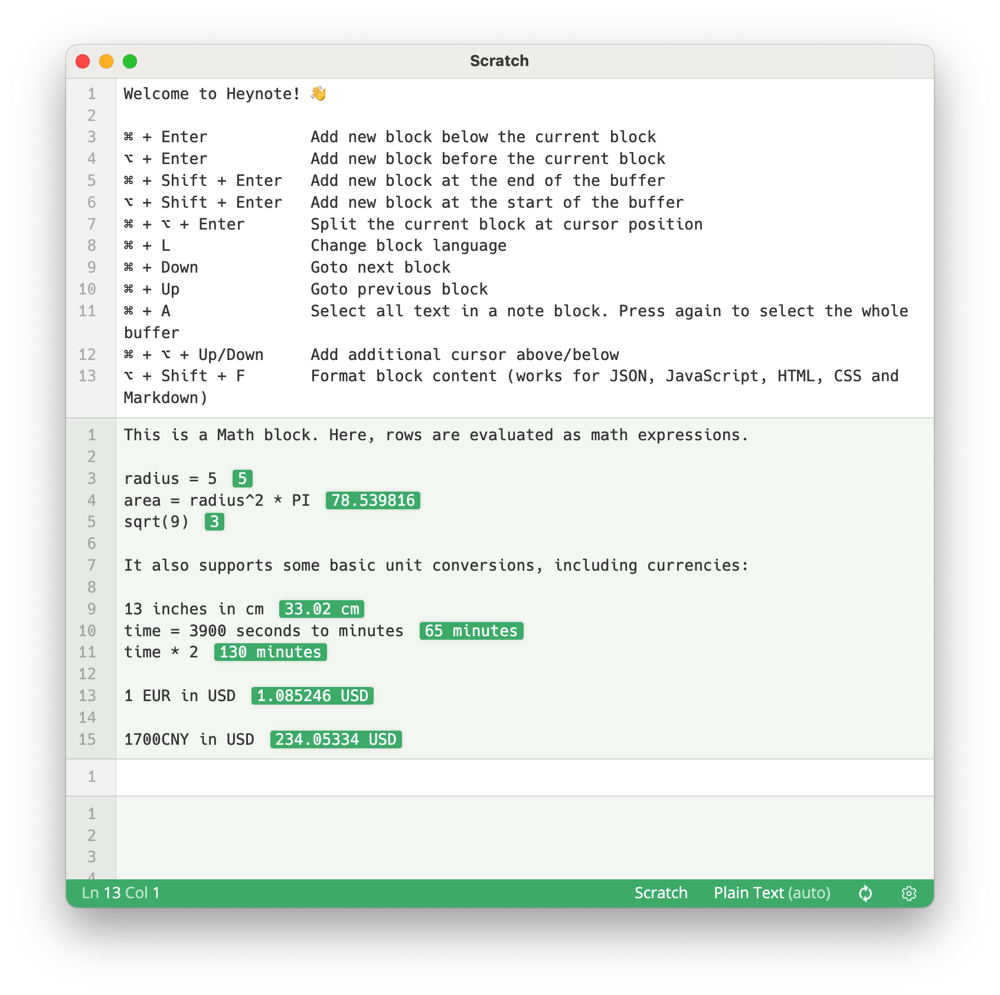

* 文本暂存。临时存放一些代码片段、待办事项

### Jump Desktop

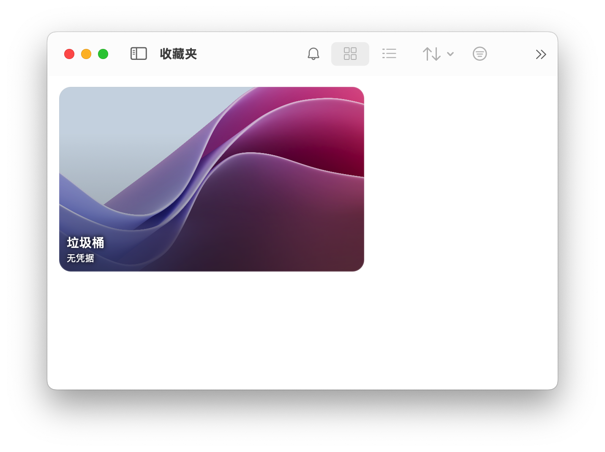

* 远程桌面连接客户端，支持 RDP、VNC 等协议，用来连 Windows、Mac 或家里的其他远程机器。

### Adobe

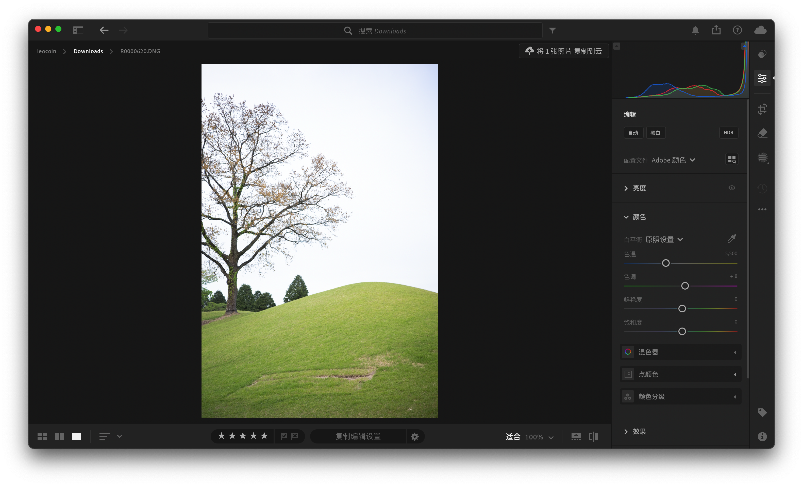

* 视频剪辑：After Effect，Premiere Pro

* 图片处理：PhotoShop，Lightroom

### Figma

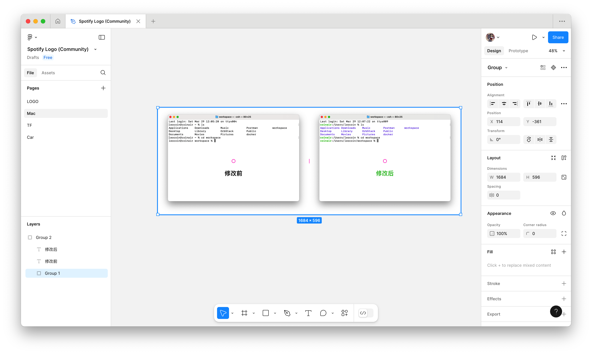

* 原型设计工具。轻量 P 图

### Spotify

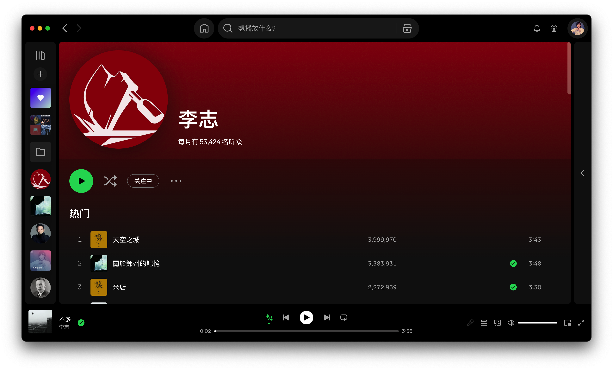

* 听歌的。

  * 跨平台体验好，能用手机控制同账号下的其他设备端播放器

  * 开放能力好，还能通过 API 进行一些插件的开发（比如获取正在听的歌，切歌等操作）

  * 曲库还算完整。~比如能听某些404的歌~

### 1Password

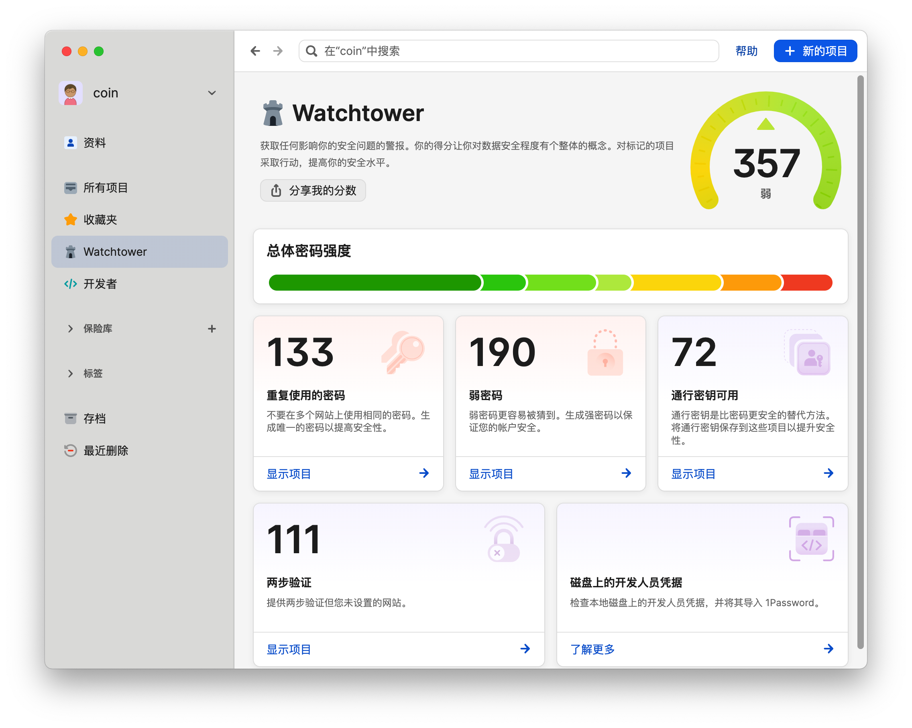

* 密码管理工具。用了这个软件之后就几乎没记过密码，也不用担心被撞库了。个人觉得最值得花钱的软件，~GitHub Education EDU 还能白嫖~

## 数据迁移

### 微信

> 2025年9月16日更新，微信4.0和3.\*大版本变更，这两个版本中用户聊天文件夹结构发生了变化，以下迁移方法失效。但可以曲线迁移：先装 [3.8.10版本的微信](https://support.qq.com/products/292433/faqs-more?id=115035https://dldir1v6.qq.com/weixin/mac/WeChatMac_10_15.dmg)，按照以下目录迁移数据，再更新到4.0，官方4.0微信在初始化时会运行内部迁移数据的逻辑，[具体操作参考官方文档。](https://support.qq.com/products/292433/faqs-more?id=115035)

小而美的数据还是太多了，手机容量不够电脑来凑，消息同步到电脑上是个不错的选择。

**备份：**[Mac 微信文档存储在](https://blog.waynecommand.com/post/wechat-mac-backup) 以下目录，退出微信，压缩打包存档。`~/Library/Containers/com.tencent.xinWeChat/Data/Library/Application Support/com.tencent.xinWeChat/2.0b4.0.9`

**恢复：**重装 macOS 和微信之后，先运行一次微信并退出，初始化创建相关文件夹后，替换当前目录 `2.0b4.0.9/`

### Chrome 浏览器

* 插件配置

  * 油猴插件：屏蔽内容农场，自定义一些本地脚本优化网页

  * 沉浸式翻译：按需无感翻译

  * CookieCloud：多端 Cookie 同步

  * Wappalyzer：网站技术栈查看

  * Memos：快速发送笔记到 self-memos

* Chrome 多用户登录

  * 工作马甲

  * 生活日常马甲

### Mail

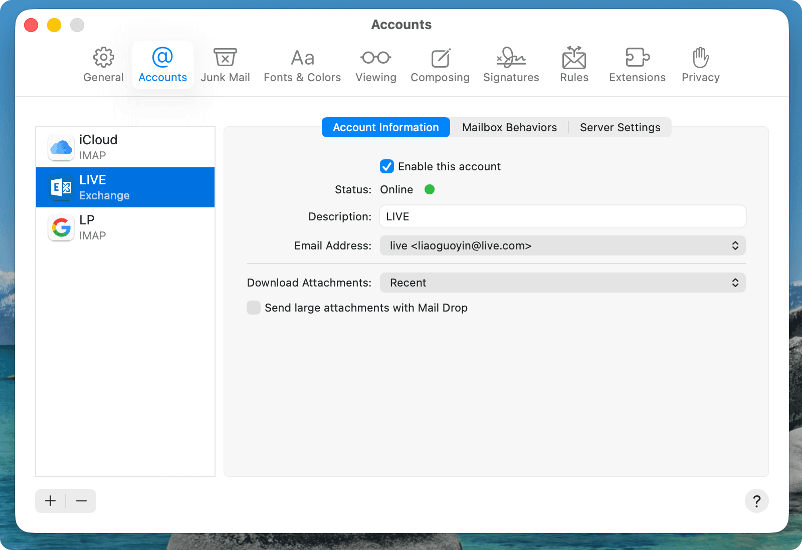邮件客户端用来用去还是自带的 Mail.app 最好用，唯一缺点就是每次换设备需要手动登录。

### SSH Config

备份恢复 SSH Config: ~/.ssh/config，并恢复公私钥：

```markup
Host xxx
    User root
    HostName x.x.x.x
    Port 22
    TCPKeepAlive yes
    ServerAliveInterval 30
    IdentityFile ~/.ssh/id_rsa

```

## 总结

对于系统配置、开发工具、应用软件，每个人的偏好和需求肯定不尽相同，按需调整即可。

啰嗦一句，保持良好的备份习惯尤其重要，配置什么的都是随便把玩的，但数据才是核心的。

不想捣鼓这些怎么办，Time Machine，你值得拥有。
